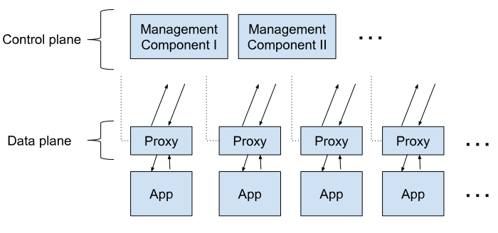

## 简介

如果您是一名软件工程师，工作在后端系统的任何地方，那么“服务网格”这个术语可能在过去几年的某个时候已经渗透到您的意识中了。多亏了一系列的事件，这个概念就像一个巨大的雪球一样在这个行业里滚来滚去，在越来越大的营销和宣传中不断地出现，而且没有任何迹象表明它会停止。

服务网格诞生于云原生生态系统中浑浊、充满潮流的水域，这意味着大量的服务网格内容，从“低热量的绒毛”到用一个技术术语来说——“基本上是扯淡”。但是，如果您能够排除所有的干扰，服务网格就具有一些实际的、具体的和重要的价值。

在本指南中，我将尝试提供一个诚实、深入、以工程师为中心的服务网格指南。我要讲的不仅是“服务网格是什么”，还有“服务网格为什么有意义”和“服务网格为什么当下有意义”。最后，我将尝试描述为什么我认为这种特殊的技术吸引了如此疯狂的炒作，这本身就是一个有趣的故事。

## 我是谁？

嗨，大家好。我是[William Morgan](https://twitter.com/wm)。我是[Linkerd](https://linkerd.io/)的创始人之一，Linkerd是第一个服务网格项目，这个项目产生了服务网格这个术语。我也是一家新兴公司[Buoyant](https://buoyant.io/)的CEO，这家公司建立了像Linkerd和[Dive](https://dive.co/)这样很酷的服务网络。

你可以想象，我是非常有偏见的，在这个问题上有一些强烈的意见。也就是说，我将尽我最大的努力把社论的篇幅控制在最低限度(除了一个部分，“为什么人们对这件事谈论得这么多？”我将尽我最大的努力以一种尽可能客观的方式来写这篇指南。当我需要具体的例子时，我将主要依赖于Linkerd，但同时当我将指出它与其他服务网格不同之处。

好吧，下面让我们开始今天的学习之旅！

## 服务网格是什么？

对于所有的宣传，服务网格在架构上非常简单。它只不过是一堆用户空间代理，被“粘在”你的服务上(我们稍后会讨论“下一步”是什么意思)，加上一组管理流程。代理被称为服务网格的数据平面，管理过程被称为服务网格的控制平面。数据平面拦截服务之间的调用并“处理”这些调用;控制平面协调代理的行为，并为您(操作人员)提供一个API来操作和测量整个网格。

这些代理是什么?它们是第7层感知的TCP代理，就像haproxy和NGINX。代理人的选择多种多样;Linkerd使用一个简单称为Linkerd -proxy的锈蚀代理，它是我们专门为服务网格构建的。其他网格使用不同的代理;使节是一个普遍的选择。但是代理的选择是一个实现细节。

这些代理做什么?当然，它们代理对服务的调用和来自服务的调用。(严格来说，它们同时充当“代理”和“反向代理”，处理呼入和呼出电话。)它们实现了一个关注服务间调用的特性集。服务之间的流量是服务网格代理与API网关或入口代理的区别所在，后者主要关注外部世界对整个集群的调用。

这就是数据平面。控制平面比较简单:它是一组组件，提供数据平面以协调方式工作所需的任何机制，包括服务发现、TLS证书颁发、度量聚合等等。数据平面调用控制平面来通知其行为;控制平面反过来提供一个API，允许用户修改和检查数据平面的整体行为。

这是Linkerd的控制平面和数据平面的示意图。您可以看到控制平面有几个不同的组件，包括一个小型的Prometheus实例，该实例聚合来自代理的度量数据，以及诸如destination(服务发现)、identity(证书颁发机构)和public-api (web和CLI端点)等组件。相比之下，数据平面只是应用程序实例旁边的一个链接代理。这只是一个逻辑图;在部署时，您可能会得到每个控制平面组件的三个副本，但会得到数百或数千个数据平面。

(图中的蓝色方框表示Kubernetes pod的边界。您可以看到，链接代理容器实际上与应用程序容器运行在相同的pod中。这种模式称为边车容器。)

服务网格的体系结构有两个重要的含义。首先，由于代理特性集是为服务到服务调用而设计的，所以服务网格只有在应用程序构建为服务时才有意义。您可以将它与一个整体一起使用，但是它需要大量的机器来运行单个代理，并且这个特性集不太适合。

另一个后果是服务网格将需要大量的代理。实际上，Linkerd为每个服务的每个实例添加一个链接代理。(其他一些mesh实现为每个节点/主机/虚拟机添加一个代理。两种方式都有很多。)大量使用代理本身有两个含义：

1. 不管这些数据平面代理是什么，它们最好是快速的。您将为每个调用添加两个代理跃点，一个在客户端，一个在服务器端。

2. 此外，代理需要小而轻。每一个都将消耗内存和CPU，并且这些消耗将随应用程序线性增长。

3. 您将需要一个用于部署和更新大量代理的系统。你不会想要手工做这个。

但是，至少在10,000英尺的高度，这就是服务网格的全部内容:您部署了大量的用户空间代理来对内部的服务到服务的流量“做一些事情”，并且您使用控制平面来更改它们的行为并查询它们生成的数据。

现在让我们来谈谈原因。

## 为什么服务网格是有意义的？

## 为什么服务网格是一个好主意？

## 哪些人可以从服务网格技术中获益？

## 服务网格解决了所有的问题吗？

## 为什么服务网格当下有意义？

## 为什么人们总是谈论服务网格？

## 那么，作为一个普通的软件工程师，我应该关心服务网格吗？

## 结论
